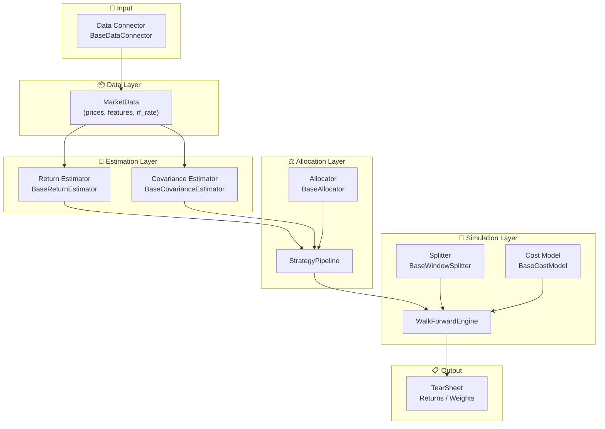

# Building Blocks

PyAlloq is built around **six composable building blocks**. Each one has a clean, stable interface. You can swap any block independently without touching the others.

This design lets you answer questions like:

> *"Does Ledoit-Wolf shrinkage improve my Markowitz backtest?"*
> *"Does James-Stein return estimation help HRP more than EWMA?"*
> *"What happens if I use Almgren-Chriss costs instead of flat fees?"*

...all without rewriting your backtesting code.

---

## The Six Blocks



---

## Block 1: Data Connector

**Package:** `pyalloq-data-connector`

Fetches raw data from any vendor and normalizes it into a `MarketData` object. Every connector wraps a different API but returns the same output.

```python
from pyalloq_data_connector.yahoo_finance import YahooFinanceClient

data = YahooFinanceClient().get_market_data(
    tickers=["AAPL", "MSFT", "GOOGL"],
    start="2022-01-01",
    end="2024-01-01",
)
```

**Available connectors:** Yahoo Finance, Alpha Vantage, Finnhub, EOD Historical Data.

---

## Block 2: MarketData

**Package:** `pyalloq-core`

`MarketData` is the **universal data container** passed between all blocks. It holds:

| Field | Type | Description |
|-------|------|-------------|
| `prices` | `pd.DataFrame` | Daily closing prices (rows = dates, cols = assets) |
| `features` | `dict[str, pd.DataFrame]` | Time-series features: volume, macro, technicals, etc. |
| `cross_sectional` | `pd.DataFrame \| None` | Market caps, sector mappings, etc. |
| `risk_free_rate` | `pd.Series \| float` | Constant or time-varying risk-free rate |
| `risk_aversion` | `pd.Series \| float` | 0 = most aggressive, 1 = most conservative |

!!! info "Zero-Lookahead Guarantee"
    `MarketData.validate_alignment()` raises an error if any feature index doesn't perfectly align with the price index.
    `MarketData.slice_time(end_date, lookback)` creates a safe time-window slice for each backtest period, preventing future data from leaking into the estimation window.

---

## Block 3: Return Estimator

**Interface:** `BaseReturnEstimator.estimate(data: MarketData) -> pd.Series`

Produces a `pd.Series` of annualized expected returns, one per asset. Plug any estimator into `StrategyPipeline`.

| Estimator | When to use |
|-----------|-------------|
| `EWMAReturnEstimator` | Recent returns matter more (default) |
| `MomentumReturnEstimator` | Cross-sectional momentum signal |
| `FactorReturnEstimator` | Factor-model attribution (Fama-French style) |
| `JamesSteinReturnEstimator` | Shrinkage — great for large asset universes |
| `ImpliedReturnEstimator` | Reverse-optimization from known market weights |
| `BlackLittermanEstimator` | Blend market equilibrium with investor views |

---

## Block 4: Covariance Estimator

**Interface:** `BaseCovarianceEstimator.estimate(data: MarketData) -> pd.DataFrame`

Produces an NxN covariance matrix. The choice of estimator significantly affects optimizer stability.

| Estimator | When to use |
|-----------|-------------|
| `EmpiricalCovariance` | Large T/N ratio, stable markets |
| `EWMACovariance` | Recent volatility clusters matter |
| `LedoitWolfEstimator` | Small sample, high-dimensional portfolios |
| `RandomMatrixTheoryEstimator` | Remove noise eigenvalues, detect true factors |
| `SemiCovariance` | Focus on downside risk only |

---

## Block 5: Allocator

**Interface:** `BaseAllocator.allocate(data, cov_matrix, expected_returns) -> OptimizationResult`

Solves for optimal portfolio weights given the estimated inputs.

**Classical (convex optimization via CVXPY):**

| Allocator | Requires returns? |
|-----------|------------------|
| `EqualWeightAllocator` | No |
| `MarkowitzAllocator` | For Max Sharpe / Max Return |
| `RiskParityAllocator` | No |
| `RiskBudgetingAllocator` | No (uses `data.features["risk_budgets"]`) |
| `MaxDiversificationAllocator` | No |

**Graph-based ML (hierarchical clustering, no matrix inversion):**

| Allocator | Method |
|-----------|--------|
| `HRPAllocator` | Hierarchical Risk Parity |
| `HERCAllocator` | Hierarchical Equal Risk Contribution |
| `NCOAllocator` | Nested Cluster Optimization |

---

## Block 6: StrategyPipeline

**Package:** `pyalloq-core`

`StrategyPipeline` is the **glue** that connects your estimators and allocator into a single callable unit. The backtest engine only knows about `StrategyPipeline` — it doesn't care which estimator or allocator you've chosen.

```python
from pyalloq_core.pipeline import StrategyPipeline

pipeline = StrategyPipeline(
    allocator=MyAllocator(tickers=...),
    returns_estimator=MyReturnEstimator(),   # optional, defaults to EWMA
    cov_estimator=MyCovarianceEstimator(),   # optional, defaults to Empirical
)

weights = pipeline.generate_weights(data)  # → pd.Series
```

---

## Block 7: WalkForwardEngine

**Package:** `pyalloq-backtest`

The engine runs your `StrategyPipeline` across rolling or expanding historical windows, applying transaction costs on each rebalance. It enforces the zero-lookahead guarantee by slicing `MarketData` before each pipeline call.

```python
from pyalloq_backtest.engine import WalkForwardEngine

engine = WalkForwardEngine(
    pipeline=pipeline,
    rebalance_freq="ME",                  # monthly
    splitter=RollingWindowSplitter(252),  # 1-year lookback
    cost_model=FlatBpsCostModel(10.0),    # 10bps per trade
)

results = engine.run(data)
# → {"returns": pd.Series, "weights": pd.DataFrame, "tear_sheet": pd.DataFrame}
```

---

## How They Fit Together

Every portfolio optimization workflow in PyAlloq follows the same linear data flow:

```
Data Connector → MarketData → [Return Estimator + Covariance Estimator] → Allocator
                                         ↕ (via StrategyPipeline)
                              WalkForwardEngine [+ Splitter + Cost Model]
                                         ↓
                                     TearSheet
```

This separation of concerns means you can:

- **Change the data source** without touching your estimators
- **Change estimators** without touching your allocator
- **Change the allocator** without touching the backtest engine
- **Change cost models or splitters** without changing anything else
