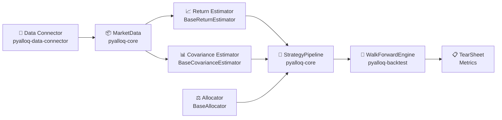

# PyAlloq

> **A modern Python SDK for quantitative portfolio optimization.**
> Build, backtest, and iterate on any portfolio strategy using a fully modular, plug-and-play architecture.

---

## What is PyAlloq?

PyAlloq is a research-grade SDK that gives you all the building blocks you need to go from raw market data to a fully backtested, production-ready portfolio strategy — without writing boilerplate.

Every component is **independently swappable**. Change your covariance estimator. Try a different allocator. Add a new return estimator. Your backtesting engine stays the same.

```python
from pyalloq_data_connector.yahoo_finance import YahooFinanceClient
from pyalloq.optimizers.classical.risk_parity import RiskParityAllocator
from pyalloq_core.pipeline import StrategyPipeline
from pyalloq_backtest.engine import WalkForwardEngine

data = YahooFinanceClient().get_market_data(
    tickers=["AAPL", "MSFT", "GOOGL", "AMZN", "TSLA"],
    start="2020-01-01", end="2024-01-01"
)

pipeline = StrategyPipeline(allocator=RiskParityAllocator(tickers=data.assets))
results  = WalkForwardEngine(pipeline=pipeline).run(data)

print(results["tear_sheet"])
```

---

## The Building Blocks

PyAlloq is organized as a set of composable building blocks. Each one has a clean interface and can be swapped out independently.



| Block | Interface | What it does |
|-------|-----------|--------------|
| **Data Connector** | `BaseDataConnector` | Fetches & normalizes market data from any vendor |
| **MarketData** | `@dataclass` | Single source of truth — prices, features, risk-free rate |
| **Return Estimator** | `BaseReturnEstimator` | Estimates expected returns for each asset |
| **Covariance Estimator** | `BaseCovarianceEstimator` | Estimates the NxN covariance matrix |
| **Allocator** | `BaseAllocator` | Solves for optimal portfolio weights |
| **StrategyPipeline** | — | Wires estimators + allocator together |
| **WalkForwardEngine** | — | Zero-lookahead backtesting with cost models |

---

## Feature Highlights

- 🎯 **5 classical allocators**: Equal Weight, Markowitz (Min Vol / Max Sharpe / Max Return), Risk Parity, Risk Budgeting, Max Diversification
- 🌳 **3 graph-based ML allocators**: HRP, HERC, NCO — no covariance inversion required
- 📈 **6 return estimators**: EWMA, Momentum, Factor, James-Stein, Implied, Black-Litterman
- 📊 **5 covariance estimators**: Empirical, EWMA, Ledoit-Wolf, RMT Denoising, Semi-Covariance
- 🔁 **3 backtest splitters**: Rolling Window, Expanding Window, Purged K-Fold (ML-safe)
- 💸 **2 transaction cost models**: Flat Bps, Almgren-Chriss market impact
- 🔬 **Zero-lookahead guarantee** via `MarketData.validate_alignment()` and `slice_time()`

---

## Workspace Architecture

PyAlloq is organized as a multi-package `uv` workspace:

| Package | Description |
|---------|-------------|
| [`pyalloq-core`](https://github.com/AlloqAlpha/pyalloq/tree/main/src/pyalloq-core) | Interfaces, `MarketData`, `StrategyPipeline`, `OptimizationResult` |
| [`pyalloq-data-connector`](https://github.com/AlloqAlpha/pyalloq/tree/main/src/pyalloq-data-connector) | Data adapters: Yahoo Finance, Alpha Vantage, Finnhub, EOD |
| [`pyalloq-backtest`](https://github.com/AlloqAlpha/pyalloq/tree/main/src/pyalloq-backtest) | `WalkForwardEngine`, splitters, cost models, metrics |
| [`pyalloq-features`](https://github.com/AlloqAlpha/pyalloq/tree/main/src/pyalloq-features) | Feature engineering: technical, cross-sectional, scalers |
| `pyalloq` | Classical + ML optimizers, estimators, deep learning models |

---

## Next Steps

<div class="grid cards" markdown>

- :material-download: **[Installation](getting-started/installation.md)** — Get up and running in minutes
- :material-rocket-launch: **[Quickstart](getting-started/quickstart.md)** — Build your first portfolio strategy
- :material-puzzle: **[Building Blocks](concepts/building-blocks.md)** — Understand the modular architecture
- :material-swap-horizontal: **[Swapping Components](concepts/swapping-components.md)** — Experiment with different strategies

</div>
